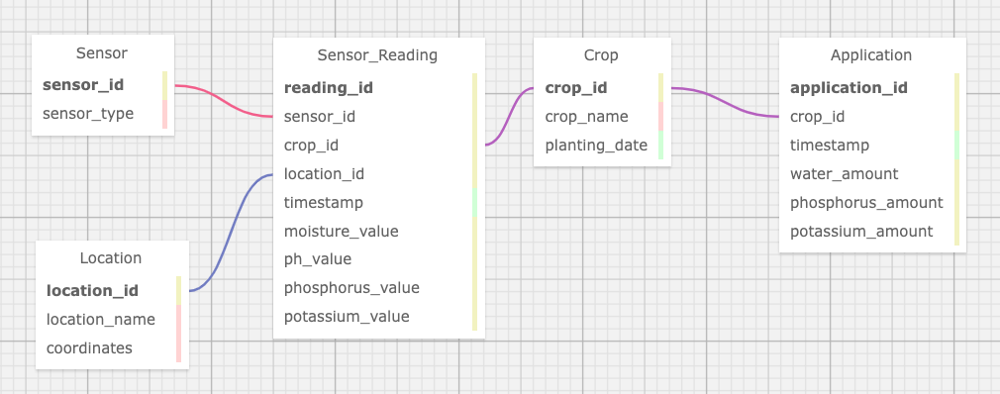

# FIAP - Faculdade de Informática e Administração Paulista

 

# Modelo de Banco de Dados para Gestão de Insumos Agrícolas

## 👨‍🎓 Integrantes do grupo: 
- <a href="https://www.linkedin.com/in/ribeirogab/">Gabriel de Oliveira Soares Ribeiro</a>

## 👩‍🏫 Professores:
### Tutor(a) 
- <a href="https://www.linkedin.com/in/lucas-gomes-moreira-15a8452a/">Lucas Gomes Moreira</a>
### Coordenador(a)
- <a href="https://www.linkedin.com/in/profandregodoi/">André Godoi</a>

## 📜 Descrição

Este repositório contém a modelagem de um banco de dados relacional para o projeto da Startup **FarmTech Solutions**, que visa otimizar a irrigação e a aplicação de nutrientes em plantações através do uso de sensores de umidade, pH e nutrientes. A modelagem foi realizada de acordo com os princípios de relacionamento de banco de dados, utilizando o [SQLDesigner](https://github.com/ondras/wwwsqldesigner) para criar o DER (Diagrama Entidade-Relacionamento).

O objetivo deste projeto é desenvolver um sistema que permita o armazenamento e a análise dos dados coletados pelos sensores, ajustando de maneira precisa a quantidade de água e nutrientes aplicados nas plantações. Isso inclui:

- Monitoramento contínuo de diferentes tipos de sensores.
- Armazenamento de leituras de umidade, pH, fósforo e potássio.
- Aplicação de água e nutrientes com base nos dados coletados.
- Capacidade de rastrear leituras e ajustes por cultura e local.

## 📁 Estrutura de pastas

Dentre os arquivos e pastas presentes na raiz do projeto, definem-se:

- **`data-model.xml`**: Arquivo XML contendo a definição do modelo de banco de dados para ser importado no SQLDesigner.
- **`data-model.sql`**: Script SQL para a criação das tabelas do modelo no banco de dados.
- **`diagram.png`**: Imagem do Diagrama Entidade-Relacionamento (DER) gerado a partir do modelo.
- **`README.md`**: Este arquivo de documentação explicando o projeto.

## 🔧 Como executar o código

1. **Pré-requisitos**: 
    - SQLDesigner para visualização e edição do diagrama.
    - Um ambiente para rodar o script SQL gerado.
  
2. **Passo a passo**:
    - Faça o clone do repositório para a sua máquina local.
    - Importe o arquivo `data-model.xml` no SQLDesigner para visualizar o modelo de banco de dados.
    - Rode o arquivo `data-model.sql` em seu banco de dados para criar as tabelas.

## Entidades Principais

### 1. **Sensor**

Representa os diferentes sensores usados nas plantações.

- **Atributos**:

  - `sensor_id`: Identificador único do sensor.
  - `sensor_type`: Tipo do sensor (Umidade, pH, Nutrientes).

### 2. **Leitura_Sensor**

Armazena as leituras feitas pelos sensores em momentos específicos.

- **Atributos**:
  - `reading_id`: Identificador único da leitura.
  - `sensor_id`: Referência ao sensor que coletou a leitura.
  - `crop_id`: Referência à cultura monitorada.
  - `location_id`: Referência ao local da leitura.
  - `timestamp`: Data e hora da leitura.
  - `moisture_value`: Valor de umidade coletado (se aplicável).
  - `ph_value`: Valor de pH coletado (se aplicável).
  - `phosphorus_value`: Nível de fósforo (se aplicável).
  - `potassium_value`: Nível de potássio (se aplicável).

### 3. **Aplicação**

Armazena os ajustes feitos na irrigação e aplicação de nutrientes.

- **Atributos**:

  - `application_id`: Identificador único da aplicação.
  - `crop_id`: Referência à cultura que recebeu a aplicação.
  - `timestamp`: Data e hora do ajuste.
  - `water_amount`: Quantidade de água aplicada.
  - `phosphorus_amount`: Quantidade de fósforo aplicado.
  - `potassium_amount`: Quantidade de potássio aplicado.

### 4. **Cultura (Crop)**

Armazena informações sobre as culturas plantadas.

- **Atributos**:

  - `crop_id`: Identificador único da cultura.
  - `crop_name`: Nome da cultura.
  - `planting_date`: Data de plantio.

### 5. **Localização (Location)**

Armazena informações sobre as localizações da plantação onde as leituras são feitas.

- **Atributos**:

  - `location_id`: Identificador único da localização.
  - `location_name`: Nome da localização.
  - `coordinates`: Coordenadas geográficas da localização.

## Relacionamentos

- Um **Sensor** pode ter várias **Leituras_Sensor** associadas (1:N).
- Uma **Cultura (Crop)** pode ter várias **Leituras_Sensor** e **Aplicações** associadas (1:N).
- Uma **Localização (Location)** pode estar associada a várias **Leituras_Sensor** (1:N).
- Cada **Aplicação** está relacionada a uma **Cultura (Crop)** (N:1).

## Diagrama Entidade-Relacionamento (DER)

## 🗃 Histórico de lançamentos

* 1.0.0 - 16/10/2024
    * Primeira versão do modelo de banco de dados criado e implementado.

## 📋 Licença

<a property="dct:title" rel="cc:attributionURL" href="https://github.com/agodoi/template">MODELO GIT FIAP</a> por <a rel="cc:attributionURL dct:creator" property="cc:attributionName" href="https://fiap.com.br">Fiap</a> está licenciado sobre <a href="http://creativecommons.org/licenses/by/4.0/?ref=chooser-v1" target="_blank" rel="license noopener noreferrer" style="display:inline-block;">Attribution 4.0 International</a>.

